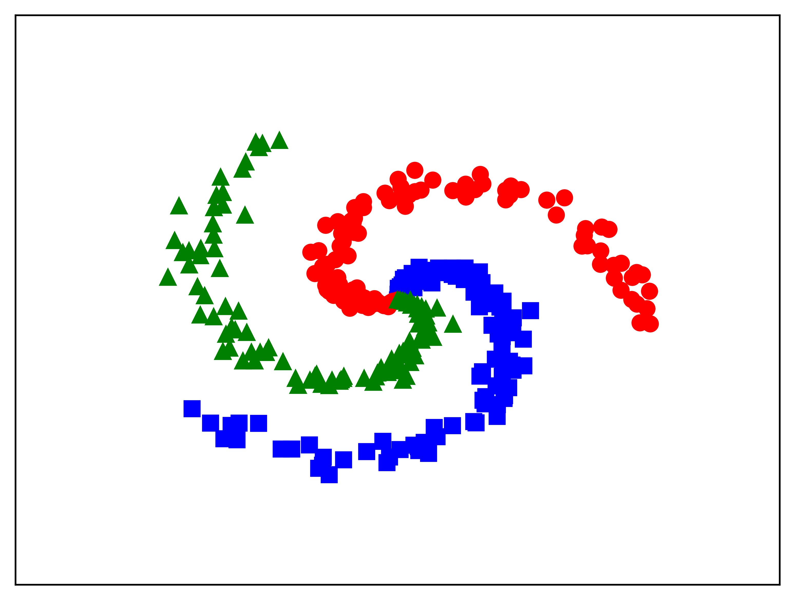
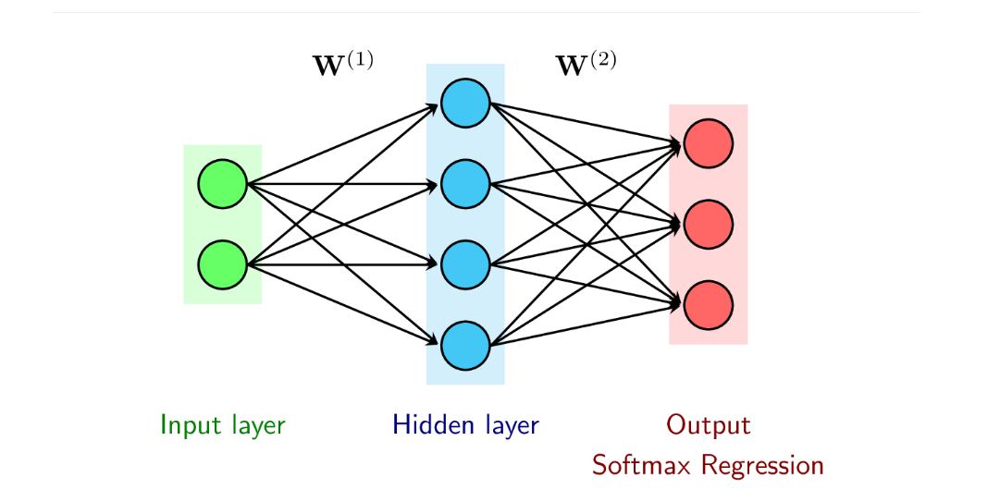
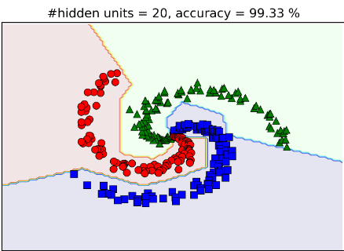

# MULTI LAYER PERCEPTRON (MLP)

## Introduction

As you know, some algorithms such as linear regression, logistic regression, softmax classification, or Perceptron learning algorithms (PLA) require classes to be linearly separable (which is difficult in real life). To solve this, a multi-layer perceptron is used.

## Problem Description
Suppose you have datasets like this:
 
The classes are not linearly separable, so we will use MLP to tackle this. We will add one hidden layer between the input layer and the output layer as shown below:
 
Your task is to train a model that classifies the data correctly.

## Behind the scenes

<a href='https://benkei-19.github.io/MultiLayerPerceptron/'> See here to more details</a>

## Result

We have 99.33% accuracy on classifying the dataset mentioned earlier using 20 hidden units and one additional hidden layer.

## Requirements
- **Python**
- **Softmax regression**
- **CrossEntropy**
- **Gradient Descent**

## References
* [Machine Learning Cơ Bản](https://machinelearningcoban.com/2017/02/24/mlp/)
* [CS231n Neural Networks Case Study](https://cs231n.github.io/neural-networks-case-study/)

